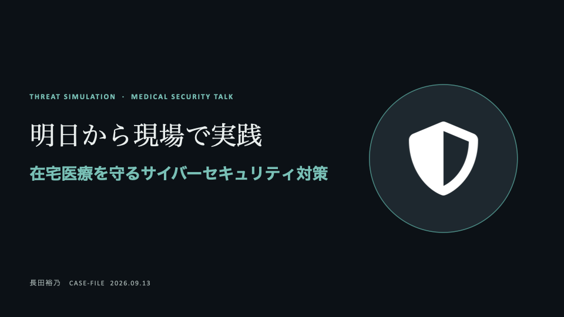
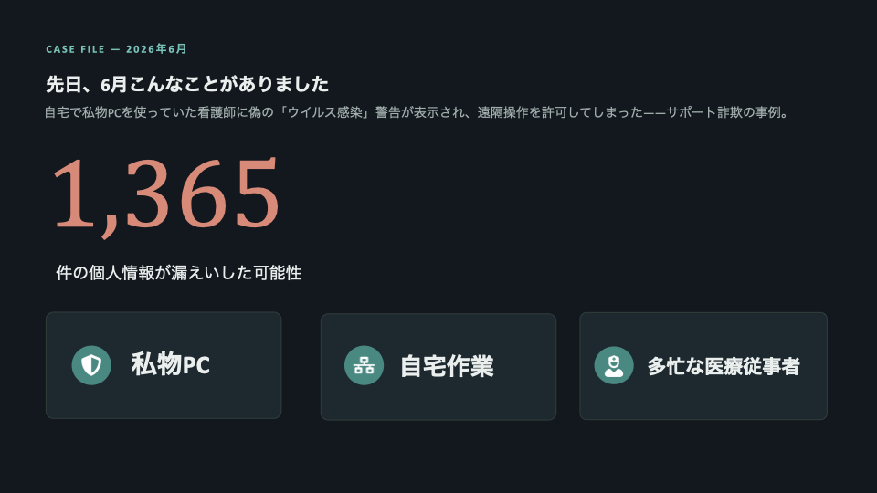
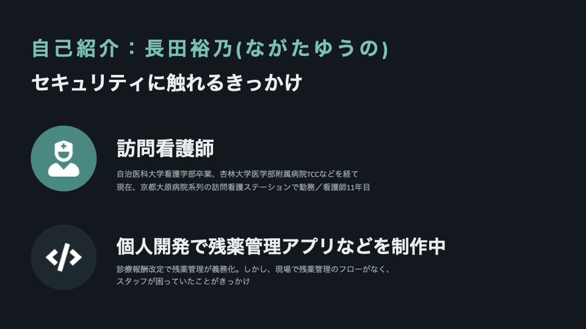
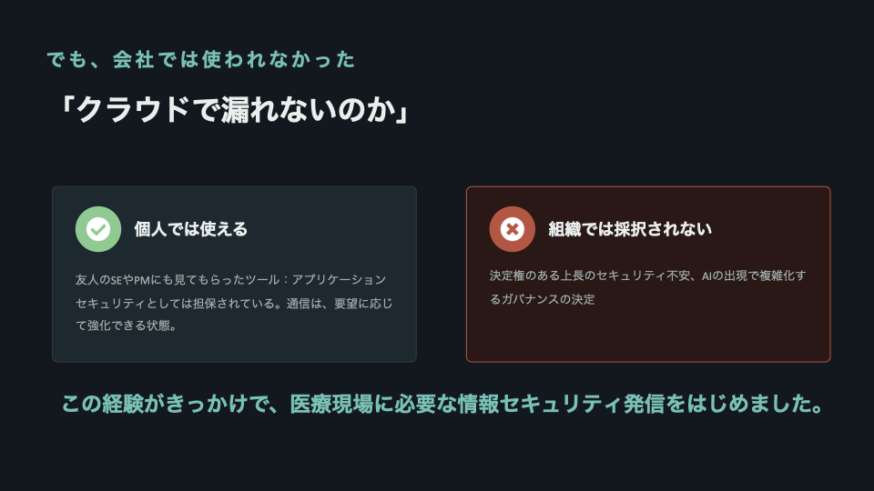
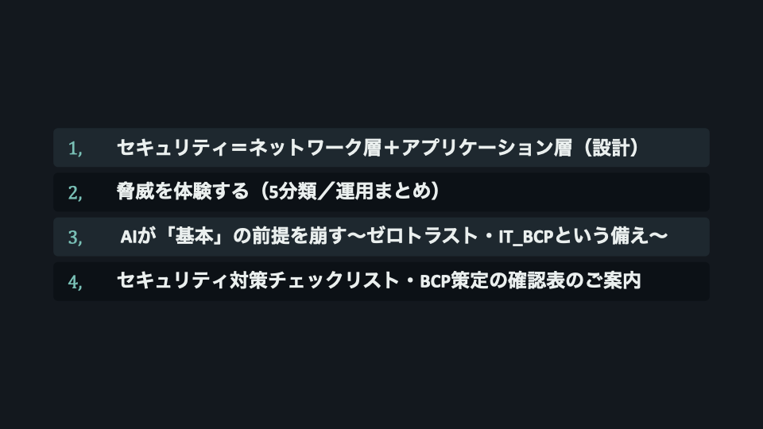
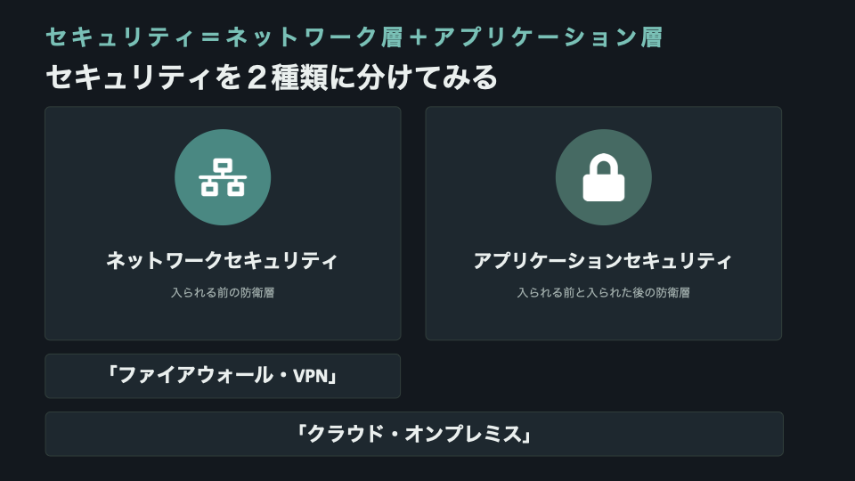
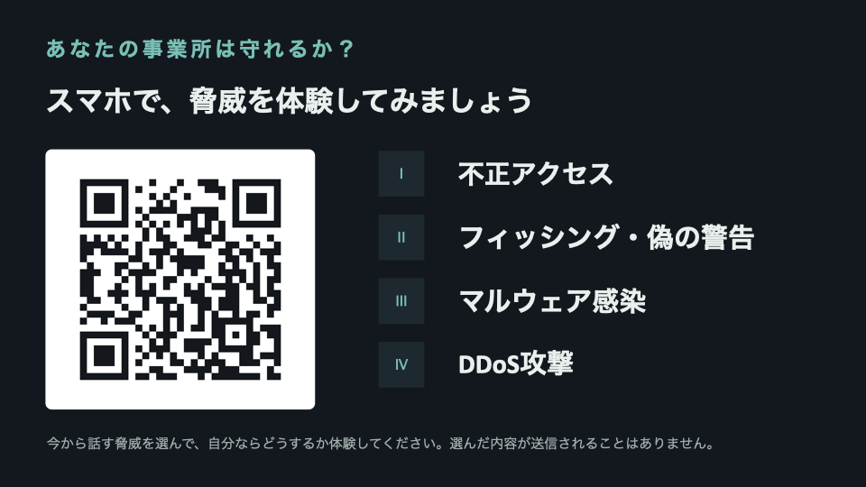
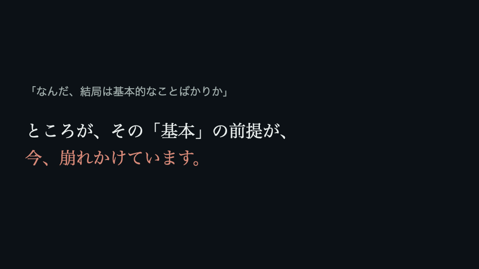
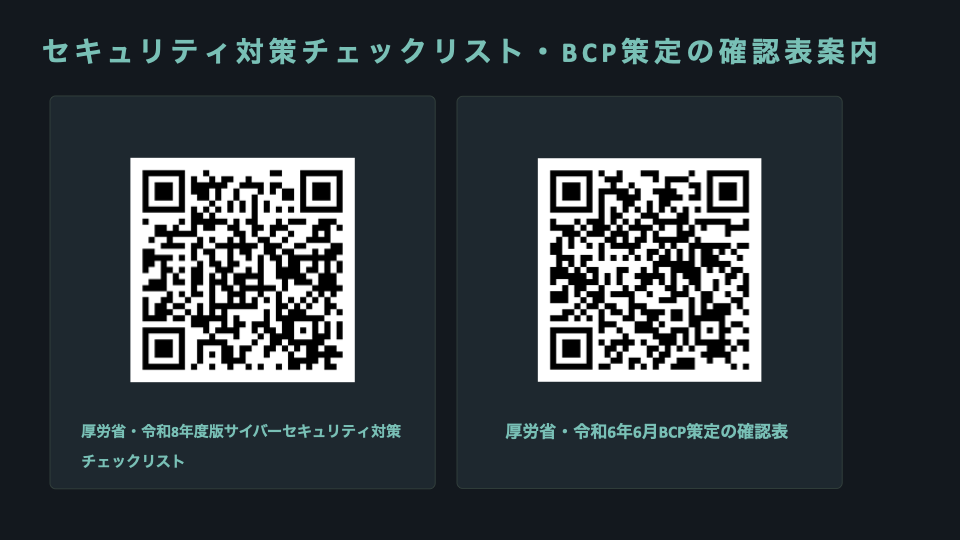
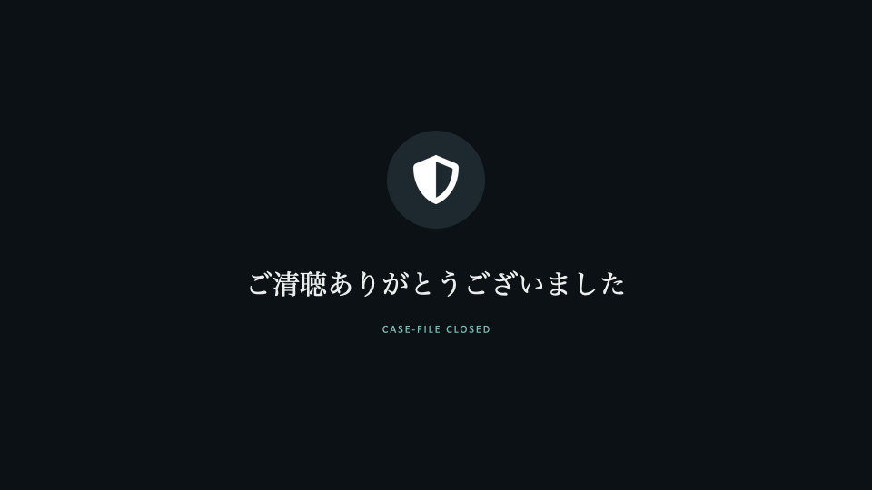

# 明日から現場で実践｜在宅医療を守るサイバーセキュリティ対策

2026年9月13日、シンポジウムで登壇しました。
タイトルは「明日から現場で実践！在宅医療を守るためのサイバーセキュリティ対策」。

会場でお話ししたことを、スライドと話した内容ほぼそのままで残しておきます。
当日いらっしゃれなかった方、事業所に持ち帰って共有したい方に届けば。

最後に、質疑応答でいただいた
**「ネットワーク層とアプリケーション層で、具体的にどんなセキュリティを施す必要があるのか」**
という質問への回答を、時間内に話しきれなかったぶんも含めて書き足しました。

---

## スライド1｜タイトル

---

## スライド2｜CASE FILE — 2026年6月

つい先日のニュースです。ある病院で、自宅で私物のパソコンを使っていた看護師のところに「ウイルスに感染しました」という警告画面が出ました。表示された連絡先にアクセスしたことで第三者に遠隔操作され、患者さんの氏名・病名・検査データなど1365件が漏えいした可能性がある、という事案です。私物のパソコンに個人情報を保存すること自体、その病院の規定では禁止されていました。

そんなこと私がしない、と思うと思いますが、私物端末での自宅作業。個人情報は持ち帰ってないにせよ。今日この会場にいる方の多くが一度は遭遇した場面だと思います。私物のPC、自宅作業、多忙な医療従事者。今日は、そんな日常に潜むサイバーセキュリティ対策についてお話します。

---

## スライド3｜自己紹介

自己紹介をさせてください。長田裕乃と申します。日頃は京都の訪問看護ステーションで一般のスタッフとして勤務しています。出身は自治医科大学の看護学部で、杏林大学附属病院のTCCに勤務した後、在宅看護に降りて看護師は11年目となります。学生の時は西川田に住んでいたので今日は懐かしさでいっぱいです。そして、今回は、登壇の機会を水上さん、伊藤先生にいただき大変ありがたく思います。

なぜ、私が登壇しているんだということについてですが、きっかけをお話させてください。今年の診療報酬改定で看護師による残薬管理が義務化なった際に、現場で残薬管理のフローがなくて困っていたスタッフにこういうアプリを作れるかと相談がありました。大学院で姿勢改善椅子を作ったりIT講師をしていた過去があったので、残薬管理用のアプリを個人で開発しました。その際に、医療機関で使えるアプリのガバナンス・セキュリティ要件に何があるかを調べ、アプリにその基準や機能を実装しました。業務でも使いたいので会社にプロダクトの設計とセキュリティ設計・運用が記載された書類とともに使っていいかを打診してみました。

---

## スライド4｜でも、会社では使われなかった

すると、上層部に掛け合ってもらえたものの、個人で使う分にはいいけれど、会社全体で正式には採択されませんでした。アプリ開発のSEさんやプロダクトマネージャーの方に目を通してもらっていたツールだったため、採択に至らなかった明確な理由を上長に確認したところ、「クラウドで患者さんの情報が漏れないのか」「オンプレのほうが安全じゃないのか」という返答が返ってきました。

この経験がきっかけで、医療現場に必要な情報セキュリティ発信をはじめました。

---

## スライド5｜本日の流れ

1. セキュリティ＝ネットワーク層＋アプリケーション層（設計）
2. 脅威を体験する（5分類／運用まとめ）
3. AIが「基本」の前提を崩す〜ゼロトラスト・IT_BCPという備え〜
4. セキュリティ対策チェックリスト・BCP策定の確認表のご案内

---

## スライド6｜セキュリティを2種類に分けてみる

私の担当では、いちスタッフの方に理解いただきたい内容をお伝えしていきます。経営層の方々はさらに、駒橋先生の資料やお話で補填いただければと思います。

さて、医療現場でITセキュリティの話となると、「ファイアウォール」「VPN」「クラウド」「オンプレミス」などの言葉が出てくると思います。それぞれ聞いたことありますでしょうか？どんな印象ですか？

これから、セキュリティをとてもざっくりと2つに分けてお伝えしていこうと思います。それぞれに守っているものが違います。ネットワークセキュリティ＝入られる前の防衛層。先ほどお伝えしたファイアウォールやVPNが該当します。アプリケーションセキュリティ＝入られる前と入られた後の防衛層、入られることを前提とした防衛層ともいえます。端末やアプリには入られる前提のセキュリティも必要です。最後に、よく聞くクラウド・オンプレミスは、両方にまたがる概念です。説明していきます。

---

## スライド7｜イメージ図：土地・道・門・家

これらを建物に例えて説明します。緑っぽい色で描かれているのがネットワーク層で、青で描かれているのがアプリケーション層、これらの設置場所はグレーで表示しています。建物に行くまでの道や門・フェンスがネットワークセキュリティです。悪意はここを通って侵入を試みます。

道は、インターネット通信やVPNなどを指します。VPNはよく聞くと思いますが「通信そのものを暗号化して守る専用通路」のことです。通常回線をより強化したものです。

門・フェンスは、ファイアウォール/UTMなどを指します。ファイアウォールは「通していい通信か」を判定するネットワークの門番。その上位互換がUTM装置です。

悪意はこれらを突破して家に向かいます。

クラウドやオンプレミスは、家が建っている土地そのものだと思ってください。オンプレミスは、通常、外のインターネットにつながっていない閉鎖式の仕組みです。外に続く道がなく自分の所有地内に道を持っています。しかし、家の中の機械が正常に動いているかを管理するために裏道を通すこともあります。閉鎖式の仕組みと言いますが、実は隠れた外につながる道があります。同じように、閉鎖式SIMや業務用VPNを敷けば、院内・事業所内だけでなくモバイル携帯からでもオンプレミス環境に入ってやり取りをすることができます。

次に、クラウドは、どこかにあるデータ置き場の中の一室を借りる仕組みです。AmazonのAWSやMicrosoftのAzureなど専用の会社が厳重に管理してくれているビルの一室のようなものです。道は専用通路はないが、中身を金庫に入れお届け先の認証をしっかりすることで安全に通信することができます。クラウドは、借りてる一室がどこの国に置かれているかに加えて、その事業者にどの国の法律が及ぶかも重要な要素です。日本の法律の効力が届く範囲にあることが、ガイドラインの遵守事項になっています。

また、厚労省のガイドラインでは、クラウド・オンプレどちらのネットワークであっても条件を満たした設定であれば、当該経路の盗聴のリスクは小さいとして適合扱いとなっています。オンプレもクラウドも条件を守って安全に使ってくださいとのことです。どっちの土地だから安全ではないという問題ではないのです。

次に、家、アプリケーション層についてお伝えします。

---

## スライド8｜アプリケーション層：認証・認可・操作ログ

いざ、家の前に悪意が入ってきましたとなると、以下の内容で守っていきます。認証・認可・操作ログです。

まず、玄関の鍵は、認証です。パスワードや指紋認証などで端末を使用していい人か、アプリを使用していい人かを確認します。それが突破されると、次に、部屋ごとの鍵、認可です。認可とは、3つの要素があってどんな役割の人か、どこまでみれるか編集できるかを判定します。役割・閲覧権限・編集権限です。

最後に、防犯カメラ・入退室ログとして、操作ログがあります。どんな損害がありそうか、損害はなくても不審な行動や会社にとって不利益につながる行動がないかを確認することができます。これがアプリケーション層、入られる前の防衛層であり入られる前提の防衛層です。この防衛層は、端末とアプリケーションそれぞれにあります。

ネットワークもアプリケーションも設計を実装するのは保守運用会社や情報システム部門の方だと思いますが、このような概要を理解してこれがそれぞれちゃんと設計されているかをやり取りできることが大切です。結局は、ちゃんとした保守運用会社に頼むというのがベストアンサーです。

今期のガイドラインでは、MDS（Manufacturer Disclosure Statement for Medical Device Security）製造業者/サービス事業者による医療情報セキュリティ開示書の提出が必須となっております。保守委託機関から医療機関に提出されるものです。そこにどのような設計か保守運用かが明記されているので、ここでちゃんとしてるかを確認し、責任の所在を明確にしておきましょう。書かれてる内容がちゃんとしててもやってくれなきゃ困ります。

---

## スライド9｜インシデント ＝ 脅威 × 脆弱性

これから具体的なサイバー攻撃事例を確認しながら、必要な運用を確認していきます。

まず、サイバー攻撃などのインシデントは、脅威×脆弱性で整理することができます。脅威は悪意そのものや技術のこと。自分たちでコントロールできません。脆弱性はセキュリティの設計や運用の隙のこと。運用の隙は、自分たちでコントロールできます。

脅威だけでは何も起きない。脆弱性だけでも何も起きない。両方が噛み合ったときに、インシデントが起こります。

今から、実際に起こった事例をアプリで体感いただき、自分自身の脆弱性（運用の隙）について確認してもらいます。そして、運用でどのようにカバーしていくか具体的な対策を知っていただき、事業所に帰って厚生省の出しているチェックリストを用いて事業所全体のマニュアル化につなげていただければと思います。

---

## スライド10｜スマホで、脅威を体験してみましょう

サイバー攻撃をさまざまな分類を参考に、医療情報セキュリティ軸で4つに分類してみました。DDoS攻撃は私たちの事前の運用ではカバーできない攻撃のため、体験アプリには含まれていません。ではQRコードを読み込んで体験してみましょう。まず、不正アクセスの体験をお願いします。

---

## スライド11｜THREAT I — 不正アクセス

如何でしたか、守れたでしょうか。

一つ目、不正アクセスです。正規の権限のない人がアクセスすること全てを不正アクセスと言います。なのでこれといろんな攻撃手法の組み合わせが起こります。

岡山県精神科医療センターの事案です。原因は保守用VPN装置の更新放置と、推測されやすいIDやパスワードの使い回しでした。かつそのID/PASSに管理者権限が付与されていた。なので、ウィルス対策ソフトの無効化やバックアップの破壊が行われ、全てのサーバー33台、端末244台が暗号化され、最大約4万人分の個人情報が漏えいした可能性があり、完全復旧まで約3か月かかっています。

ここで考えたいのが、PC端末へのログインが共通ID・パスになっているということはとてもよくあることです。私の事業所も、モバイルもPC端末へのログインも共有アカウントです。

---

## スライド12｜THREAT I の対策と、多要素認証の「要素」

それを踏まえた上で、今日から現場でできること、打診できることです。

ベストは一人一ID。ですが、難しいので共有アカウントを使用する場合は管理者権限を付与しない。管理者は一人一IDで使用する。

次に、多要素認証の検討です。パスワードだけじゃなくて多くの要素を用いて認証する、ということです。が、じゃあ何を組み合わせることを指すのか。要素には3種類あります。知識情報、所持情報、生体情報です。わかりやすいのはいつも使ってる知識情報と生体情報です。所有情報というのは、ワンタイムトークンやICカードなどのことです。

実はこのガイドライン第7.0版では、二要素認証が令和9年4月1日以降、システムを新規導入・更新するタイミングから義務化されます。異なる2つの要素を組み合わせた認証です。結局、義務化されるのであれば早めに導入して徐々に慣れてもらう方が良い策かもしれません。

逆に、パスワードの定期変更は「不要」と明記されました。3ヶ月毎に定期的にパスワード更新するなどしてる所もあると思います。これはガイドラインでは不要になりました。システム毎、端末ログイン・電カル・その他のシステムログインそれぞれで違うidとpassを使用することが大事ということです。

最後に、パスワード横流しを阻止する・管理下におくという意味で、退職者アカウントの無効化と削除もやっておきましょう。

では次に、フィッシング・偽の警告を体験してみてください。

---

## スライド13｜THREAT II — 標的型メール攻撃（フィッシング）

如何でしたか、守れたでしょうか？

二つ目、フィッシング・偽の警告です。スライドの事例は岡山大学病院の事案です。医師が個人で使っていたクラウドサービスのIDとパスワードを、フィッシングメールに入力して盗まれてしまいました。そして、大学病院の規定に反して、クラウドに患者情報のファイルが保存されており、延べ269人分の個人情報が流出したものです。

大事なのは、電子カルテには一切侵入されていないという点です。基幹システムは無事でした。それでも、患者さんへの説明と謝罪、そして公表に至っています。

そして、侵入から発覚の日にちは公表されていませんが、医師が自分のクラウドに入れなくなって、初めて気づいた事案です。攻撃者がパスワードを変えなければ、気づけていなかった可能性があります。

決められた場所以外に患者情報を置かない、という運用の問題でした。

---

## スライド14｜フィッシングには、2つの型がある

ちなみに、フィッシングには2つの型があり、仕込む型と盗む型があります。皆さんに体験していただいた通りです。

盗む型は、偽の画面でIDとパスワードを入力させて、鍵そのものを盗みます。
仕込む型は、ファイルやリンクを開かせて、パソコンに裏口を作る型です。

実は、つい先日、身近でこの仕込む型の事案がありました。

外部とのやりとりに使っている部門の共有アドレスに、フィッシングメールが届きました。外部からのメールを受け取れるようになったばかりの、社歴の浅いスタッフが開き、リンクを踏んで、ZIPファイルをダウンロード実行してしまいました。

アプリをインストールしたわけではないので、Windows Defenderもセキュリティソフトも反応しませんでした。たまたま熟練の総務のスタッフが気づいたため、ログを確認し実害なしでことなきを得ました。が、実際であれば、侵入されてから気づくまでに時間がかかる特徴があり、気づいた時には事態が大きくなっていると言うことが多いです。

---

## スライド15｜THREAT II の対策

まず、スタッフ一人ひとりが今日からできることです。さきほどスマホで体験していただいた、4つの確認です。ドメイン、宛先と内容、リンクと添付ファイル。不審な点や身に覚えがあっても一旦は慎重に開かないでおきましょう。

メールでファイルもやり取りせず、社会であれば基本的に、社用フォルダで必要書類はやり取りできるのがベストです。

そして4つ目がいちばん大事です。IDとパスワードは、メールのリンク先では入力しない。いつも使っているアプリやブックマークから入るようにしましょう。

そして、組織で検討することが2つあります。

ひとつ目、フィッシング耐性のある認証を選ぶこと。フィッシング耐性のある要素認証は指紋や顔、ICカードです。文字列は偽装できるので、ワンタイムトークンも不向きです。フィッシング耐性のある二要素認証が導入されていれば、ID/PASSを万が一盗まれてしまっても、次の認証で侵入を防ぐことができます。人は間違えるものです。なので、仕組みで間違っても大丈夫な状態を作りましょう。ガイドライン第7.0版では、「フィッシング耐性」を認証の保証レベルの要件に入れています。

ふたつ目、フィッシング訓練です。厚生労働省の資料でも、全職員を対象とした定期的な教育とフィッシング訓練が挙げられています。KDDIでは、社員全員に意図的に偽のフィッシングメールを送り、引っかかった人は研修呼び出しをするなどが取り入れられています。めっちゃ怖いですよね。

一方で、仕込む型は、マルウェアスパムとも呼ばれ、マルウェア感染との複合型です。気をつけていても間違えて開いてしまうことがあります。開いてしまった後、何が起きて、組織として何を備えるか。それは次の「マルウェア感染」でまとめてお話しします。

---

## スライド16｜THREAT III — マルウェア感染

如何ですか、防げましたでしょうか？

三つ目、マルウェア感染です。マルウェア感染＝悪意のあるソフトを入れられること。暗号化して使えなくするもの（ランサムウェア）もあれば、侵入した瞬間は何も起こさず、静かに居座るものもある。その中でもランサムウェアは、金銭要求されるものです。近年は、暗号化し機能不全にするだけでなく先に情報を盗んでおいて、「払わなければ公開する」と脅す。二重恐喝が主流です。

事例を2つ、並べて見てください。

左が国分生協病院。2024年2月です。画像管理サーバーという、部門単位で使っているシステムが暗号化されました。原因は3つ重なっています。そのサーバーにウイルス対策ソフトが設定されていなかったこと。事業者が保守用に置いた機器から、認証なしで院内のパソコンに接続できる設定だったこと。そして、その保守用機器にインターネットから接続できる状態だったことです。

結果、診療記録のPDFが開けなくなり、救急と一般外来の受け入れを制限しながら紙カルテで運用。仮復旧まで約20日かかっています。電子カルテ自体は無事でした。それでも、これだけ止まりました。

右が日本医科大学武蔵小杉病院。今年2月です。深夜1時50分、病棟のナースコール端末が動かなくなりました。ナースコールを管理するサーバー3台が感染していました。侵入経路は、医療機器保守用のVPN装置です。漏えいの可能性があるのは約1万人分。身代金は1億ドル、約150億円を要求されたと報じられています。外来も入院も救急も、通常どおり続けられており、病院は応じず、被害届を出しました。

画像管理サーバーも、ナースコールも、情報システム部門ではなく各部門が独自に導入・運用していた設備でした。だから情報部門の目が届かず、その保守経路が裏口になってしまいました。「院内にあるから」「いつも動いている設備だから」という理由で誰も疑わなかった機器が、そのまま侵入経路になりました。

オンプレミスの中にいるから安全、という考え方は、もう成立しません。または、保守用VPNで感染したら保守用会社に慰謝料請求しますと明記しておきましょう。これは冗談です。

被害規模の目安として、警察庁のデータでは復旧費用が1,000万円を超えたケースが約半数、復旧に1か月以上かかった企業が約4割です。

---

## スライド17｜THREAT III の対策

では、何を対策したら良いか。

まず、スタッフ一人ひとりが今日からできること。4つです。

ひとつ、対策ソフトが動いているか確認する。国分生協病院では、暗号化されたサーバーに、そもそも対策ソフトが入っていませんでした。動いているかどうかに気づけるのは、その機器を毎日使っている現場の人です。

ふたつ、更新の通知は閉じずに、その日のうちに更新する。更新プログラムが配られるのは、そのソフトや機器に欠陥が見つかったときです。欠陥が見つかると、「この製品のこのバージョンには、こういう弱点がある」という情報も公開されます。使う人に知らせるためです。ところが攻撃者もその情報を見ていて、まだ更新していない機器を探し回ります。更新が出た瞬間から、更新していない機器は狙われやすくなります。

みっつ、私物のUSBを業務PCに接続しない。私物のUSBが感染していたら、業務PCも感染してしまいます。

よっつ、それでも私物のパソコンを使う場面があるなら、業務用と同等の対策を入れる。ガイドラインにも、BYOD端末であっても医療機関が管理する機器と同等の対策を講じること、と明記されています。

ここからは、組織で検討することです。3つに分けました。

### 【感染防止・発見】

まず、セキュリティ対策ソフトを導入・更新する。セキュリティ対策ソフトは、知っている悪者と照合するソフトです。世界中で見つかったウイルスの特徴を一覧にして持っていて、入ってきたファイルと突き合わせる。だから、その一覧を常に最新にしておくことが前提になります。

では、そこを通過してしまうものは何か。3つあります。

ひとつ、パスワード付きのZIPファイル。中を自動で開けないので、検査そのものができません。
ふたつ、まだ一覧に載っていない新しいもの。
みっつ、これがいちばん厄介です。もともとパソコンに入っている道具を使われる場合です。攻撃者が新しいアプリを入れずに、Windowsに最初からある機能を動かすと、対策ソフトから見れば正規のソフトが動いているだけなので、反応しません。

だから、そこを通過してしまうものを捕まえる層が必要になります。それがEDRとUTMです。

EDRは、侵入されることを想定したソフトです。ファイルが悪いかどうかではなく、パソコンが変な動きをしていないかを見ます。メールソフトが勝手に別のプログラムを起動した、深夜に見慣れない海外のサーバーと通信を始めた。そういう振る舞いを捕まえます。ガイドライン第7.0版にも、対策ソフトを導入しても全てのマルウェアが検出できるわけではないとしたうえで、EDRによる振る舞い検知も有効な方策である、と書かれています。

UTMは、ソフトではなく機械です。事業所のインターネット回線の出入り口に置く箱で、ファイアウォールとウイルス検査と、不審な通信の遮断が1台にまとまっています。静的なマルウェアであるバックドアは、外の攻撃者と通信をし攻撃を行います。その外部通信を出口で止めるのがUTMです。

### 【機器の把握】

アプリ許可リストは、許可したソフトしか動かさない設定です。悪いものを弾くのではなく、許可したものだけを動かす。考え方が逆なので、まだ知られていない攻撃にも強い。ただ、新しいソフトを入れるたびに手続きが要るので、運用の手間は増えます。

そして、全機器の棚卸しです。ここがいちばん大事かもしれません。二つの事例どちらも情報部門の管理外にあった機器でした。誰の担当でもない機器を、なくす。ここが一番大事です。

### 【復旧】

書き換えのできないオフラインのバックアップを、3世代以上。攻撃者は暗号化を始める前に、バックアップを探して破壊します。ネットワークにつながったままのバックアップは、一緒にやられます。

以上がマルウェア感染対策です。

---

## スライド18｜THREAT IV — DDoS攻撃

四つ目、DDoS攻撃です。これだけは、正直に言うと現場スタッフの行動が原因になることはありません。Web予約システムがつながらない、公開サイトが落ちる、という形で表面化します。

迷惑ではありますが、基幹システムが使えなくなることもなく、重要な問題じゃなく感じる方もいるかもしれませんが。

情報セキュリティには、3つの要素があり、それを担保することが求められます。

機密性。許可された人だけが見られる状態です。ここまでお話ししてきた、情報が漏れる、という話がこれにあたります。

完全性。記録が正確で、改ざんされていない状態です。カルテの内容が書き換えられていないことを保証します。

そして可用性。必要なときに、使える状態です。

DDoS攻撃が狙うのは、この3つ目です。情報は盗まれません。書き換えられもしません。ただ、使えなくなる。守るべきものは、情報だけではありません。

今日からできることとして、止まったときにどう動くかを決めておくことです。紙運用への切り替え手順や保守運用会社への緊急連絡網を、自分の事業所が持っているか、今日帰ったら確認してみてください。

---

## スライド19｜運用まとめ

ここまででた運用まとめです。

おかしいと思ったら報告、やってしまったかもと思ったら報告。それに気づける知識が大切です。その報告を責めない文化も大切です。

---

## スライド20｜「なんだ、結局は基本的なことばかりか」

ここまで聞いて、「なんだ、結局は基本的なことばかりか」と、少し安心された方もいるかもしれません。パスワードを使い回さない、リンクを不用意に踏まない、違和感を報告する。今までも言われており、難しい話ではありません。

ところが、その「基本」の前提が、今、崩れかけています。

---

## スライド21｜AIによって、脅威が上がっている

Claude Mythosなどの極高性能なAIによって、脅威が上がっています。フィッシングメールの文面から不自然な日本語や違和感が消えつつあるのは、そのひとつに過ぎません。

海外では、こんな事件も起きています。2024年2月、香港のある企業で、経理担当者がAIで合成した「同僚の姿」によるビデオ通話にだまされ、約38億円を送金してしまいました。声も、映像も、AIで簡単に模倣できる時代です。医療現場でいえば、「ベンダーの担当者」や「上長」を装った電話やビデオ通話で、パスワードの変更や緊急のアクセス許可を求められる——そんな手口も、もう絵空事ではありません。

攻撃者側の効率も上がっています。以前は人手で探していた「更新されていないVPN機器」「弱いパスワードのアカウント」を、AIが自動で、しかも高速に見つけ出せるようになってきています。

---

## スライド22｜ゼロトラストとIT_BCPという備え

ここまで、運用でできることをたくさんお伝えしてきました。でも、正直に言います。どれだけ運用を徹底しても、「絶対に何も起きない」とは言い切れません。AIによって攻撃がここまで巧妙になっている以上、なおさらです。

だからこそ大事なのが、「入られる前提の守りがあること」、「起きたときにどう動くか」です。

まず、入られる前提の守り。それがゼロトラストという考え方です。境界の内側なら安全、という前提をやめて、すべてのアクセス・すべての機器を、その都度検証する考え方です。ただ、ガイドラインでは、ゼロトラストを実装するには費用や管理の負担が大きく、小規模な医療機関で導入することは必ずしも容易ではない、とも述べられています。

そしてもうひとつが、起きたときにどう動くかです。これを事前に決めておくのが、事業継続計画、通称IT_BCPです。

厚生労働省は令和6年6月に、「サイバー攻撃を想定した事業継続計画（BCP）策定の確認表」を出しています。平時・検知・初動対応・復旧処理・事後対応の5段階で、何を決めておくべきかが一覧になっています。

---

## スライド23｜チェックリスト・BCP策定の確認表のご案内

今日ご案内するチェックリストが「日々の備え」だとすれば、BCPは「起きてしまったときの備え」です。あわせて持ち帰って、事業所で埋めてみてください。

- 厚労省・令和8年度版 サイバーセキュリティ対策チェックリスト
- 厚労省・令和6年6月 BCP策定の確認表
- 医療情報システムの安全管理に関するガイドライン 第7.0版（令和8年6月）

今日お伝えしたいことは以上になりますが、最後に。

私は、作業的な業務を楽にして、医療を支える人たちが少しでも元気に利用者さん患者さん、医療従事者の方と向き合えるようになれたらなと感じています。そのために、不必要なセキュリティ不安をなくしたいです。今日もそのためにここに来させていただきました。

不必要なセキュリティ不安が拭えていること、これをやればいいんだって思っていただけていたら嬉しいです。医療者が医療ドメインだけでなく、必要最低限の法務やエンジニアリングを理解することができれば、何を対策すれば良いかがわかり、保守運用会社に的確な要求をすることができます。わからないから怖いから何も導入しない、大丈夫と言われるがままの状態になってしまうことを防ぐことができます。

私自身は、内製化、自分たちで必要なものは作って使うが、一番業務効率化の近道だと思ってるので、その文化も広げていけたらなと思っています。

ご清聴ありがとうございました。

---

## スライド24｜CASE-FILE CLOSED

---

# 質疑応答より｜ネットワーク層とアプリケーション層で、具体的にどんなセキュリティを施す必要があるのか

登壇後の質疑で、こんな質問をいただきました。

> ネットワーク層とアプリケーション層で、具体的にどんなセキュリティを施す必要があるのか。

その場では時間の都合で要点しかお答えできなかったので、ここに書き足しておきます。

先にお伝えしたいのは、**これは「自分たちで実装するリスト」ではない**ということです。
実装するのは保守運用会社やベンダーです。

私たちがやるのは、**それがちゃんと施されているかを確認すること**。
確認のための地図が要る。その地図が、以下です。

---

## 勘所は、3つ

### ① 契約している会社のMDS/SDSで、要件を守った設計になっているか

ここが出発点です。

ガイドライン第7.0版で、MDS/SDS——製造業者・サービス事業者による医療情報セキュリティ開示書——の提出が必須になりました。保守委託先から医療機関に出される書類です。

「うちのセキュリティ、どうなってますか？」と口頭で聞いても、たぶん「大丈夫です」と返ってきます。
そうではなく、**開示書に書いてあることと、ガイドラインの要件を突き合わせる**。

見るべき項目を挙げます。

- 取り扱うデータの項目（患者氏名・病名・検査データ……どこまで持つか）
- 保存場所。どの国のどのリージョンか
- その事業者に、どの国の法律が及ぶか（日本の法令の効力が及ぶ範囲であることが遵守事項）
- 通信の暗号化と、保存時の暗号化。鍵は誰が持つか
- 認証方式。二要素に対応しているか。対応していないなら、いつ対応するか
- 権限管理。役割ごとに分けられるか。管理者権限を誰が持つか
- 操作ログ。何を、どれだけの期間、残すか。医療機関側から見られるか
- バックアップ。世代数、オフラインの保管場所におけるか、書き換え不可か
- 脆弱性対応。更新の提供方法と、製品のサポート期限
- インシデント時の連絡先と、責任分界
- 再委託先があるか。あるなら、そこの要件はどうか

### ② サーバーやUIに繋がるとき、どこにデータがあるか

いちばん見落とされるのが、ここです。

「クラウドだから安全」「オンプレだから安全」ではなく、
**そのデータが今どこに置かれているかを、経路ごとに言えるか**。

書き出してみると、思っているより多いです。

- 入力している画面（UI）が動いている端末
- そこから出ていく通信の経路
- 保存されているサーバー（クラウドなら、どの国のどのリージョンか）
- バックアップの保管先
- 操作ログの保管先
- 保守運用会社が使っている保守端末・保守経路
- そして——**ダウンロードフォルダ、キャッシュ、スクリーンショット、メールの添付、個人のクラウド**

決められた場所の外にデータが一度出ると、
どれだけ立派なネットワーク設計をしても、その外側で漏れます。

### ③ そこへのアクセスを、どう絞っているか

データの居場所がわかったら、次はそこへの入口です。

- **認証ログインが二要素になっていること**（令和9年4月1日以降、新規導入・更新のタイミングから義務化）
- **簡単すぎるパスワードになっていないこと**（定期変更はもう不要。使い回さないことのほうが大事）
- **一人1IDであること**（共有アカウントをやめる。難しければ、せめて管理者権限は付与しない）

---

## ネットワーク層で、具体的に施すもの

「入られる前の防衛層」です。ここは基本的にベンダー・情報システム部門の領域ですが、確認はできます。

| 施すもの | 何のためか | 医療機関側の確認ポイント |
|---|---|---|
| ファイアウォール／UTM | 通していい通信かを判定し、外への不審な通信も止める | 設置されているか。ログは取れているか。誰が設定を管理しているか |
| VPN機器の脆弱性管理 | 更新放置が最大の侵入口 | 機種とバージョン、サポート期限。更新は誰がいつ行うか |
| 保守用のリモート経路 | 常時つながっている裏道をなくす | 常時接続か、必要時のみ開通か。認証はあるか。誰が使ったかログに残るか |
| 管理画面をインターネットに晒さない | 探索は自動化されている | 外から到達できる機器・管理画面がないか |
| ネットワークの分離 | 部門システム・医療機器を業務LANと分ける | 画像管理サーバー、ナースコール、複合機、Wi-Fi（業務／ゲスト）が分かれているか |
| 通信の暗号化 | 経路上の盗聴を防ぐ | クラウドなら専用線でなくとも、条件を満たせば適合扱い |
| DDoS対策（CDN等） | 可用性を守る | 契約・SLAに含まれているか。止まったときの紙運用と緊急連絡網 |
| 全機器の棚卸し | 「誰の担当でもない機器」をなくす | 部門が独自に入れた機器まで台帳に載っているか |

最後の行が、いちばん効きます。
国分生協病院も、日本医科大学武蔵小杉病院も、**情報システム部門の管理外にあった機器と、その保守経路**が入口でした。

---

## アプリケーション層で、具体的に施すもの

「入られる前と、入られた後の防衛層」です。
スライド8でお話しした、**認証・認可・操作ログ**の3つが軸になります。

| 施すもの | 何のためか | 医療機関側の確認ポイント |
|---|---|---|
| 認証（あなたは誰か） | 玄関の鍵 | 二要素になっているか。フィッシング耐性のある要素（指紋・顔・ICカード）か |
| パスワードの強度 | 推測・使い回しを潰す | 短すぎないか。システムごとに別か。定期変更は不要 |
| 一人1ID | 誰がやったかを特定できる状態にする | 共有アカウントがどこに残っているか。管理者権限は分離されているか |
| 認可（どの部屋に入れるか） | 役割・閲覧権限・編集権限 | 最小権限になっているか。全員が管理者権限、になっていないか |
| 操作ログ（誰が何をしたか） | 検知と、事後の追跡 | 取得されているか。改ざんされない場所にあるか。誰かが定期的に見ているか |
| アカウントのライフサイクル | 放置アカウントを消す | 入職・異動・退職で即時に反映されるか。退職者アカウントは無効化のうえ削除 |
| 保存データの暗号化と所在 | 漏れても読めない状態に | 保存先のリージョンと準拠法。鍵の管理者 |
| 端末側の防御（EDR・対策ソフト） | 入られた後の振る舞いを捕まえる | 稼働しているか。更新されているか。BYODにも同等の対策があるか |
| アプリ・OSの更新 | 公開された弱点を塞ぐ | 更新通知を放置していないか。サポート切れの製品が残っていないか |
| バックアップ | 復旧の最後の砦 | 書き換え不可・オフライン・3世代以上。攻撃者はまずここを壊しにきます |

---

## 結局、現場が持つべき問いは3つ

長く書きましたが、明日ベンダーや上長に投げる問いに圧縮すると、こうなります。

1. **MDS/SDSを見せてください。** ガイドラインの要件と、どこがどう対応していますか。
2. **患者情報は、いま具体的にどこにありますか。** 保存先・バックアップ先・ログ・保守端末まで含めて。
3. **そこに入る鍵は、二要素ですか。一人1IDですか。使い回されていませんか。**

わからないから怖い、怖いから何も導入しない。
その状態から抜けるために必要なのは、専門家になることではなくて、
**この3つを聞ける言葉を持つこと**だと思っています。

聞かれた側も、聞かれれば答えます。
聞かれないから、そのままになっているだけ、ということが、けっこうあるので。

---

## 編集メモ（公開前に削除）

- 本文の解説は、Keynoteの発表者ノート（登壇者原稿）をほぼそのまま使用。以下だけ最小限の調整を入れた。
  - スライド23：「防ぐことができます」の脱字を補正
  - スライド21：ディープフェイク事件の出典注記を、ノート末尾の括弧書きから本文末の注記に移動
  - 各スライドの箇条書きは、画像があるため本文への転記を省略（スライド5・19・23のみ要点を再掲）
- スライド画像：`images/gakkai-20260913/slides.001〜024.png`（原本と .key/.pptx は brain の `01-projects/speaking/20260913_在宅医療連合学会-地域フォーラム/`）（Keynoteから書き出し）
  - note に上げるときは、画像パスを差し替えるか、note のエディタに直接ドラッグ
- 「如何でしたか、守れたでしょうか」など会場での体験アプリ前提の呼びかけは、あえて残してある。
  読み物として整えるなら、体験アプリ（threat-sim）のURLを併記するか、その一文を落とす
- 実名で出ている固有名詞：水上さん、伊藤先生、駒橋先生、勤務先、出身校。公開範囲に応じて要判断
- 冒頭のリードとQ&Aセクションのみ書き下ろし
