在宅医療を狙う攻撃を4つに分類して、それぞれの対策まで書き出してみた
学会で100名規模の管理者向けに話した内容の全文。事例の数字と、現場で明日から引ける線。
yuno
（下書き・2026年9月）

5月に、2本の記事を書きました。

1本目で「時代に、医療現場のITリテラシーが追いついていない」という話を。2本目で「セキュリティは場所ではなく、設計と運用である」という話を。

9月13日、機会をいただき、その続きを学会の会場でお話してきました。第8回 日本在宅医療連合学会 地域フォーラム。90分のセッションで、ありがたいことに、2026年6月に医療情報システム安全ガイドライン7.0版を出した厚生労働省の方も一緒に御登壇いただきました。

5月の記事はブラウザ経由のアプリを使用する時のアプリ側の設計と運用をお伝えしました。
今回は、医療機関のサーバー攻撃とその経営インパクトの実例をもとに、サーバー攻撃の**脅威を分類し、対策は何か。**をお伝えします。

---

## 脅威が通るセキュリティ層がどのようになっているか

その前に、**脅威が実際にどこを通ってくるのか**を建物を用いて説明していきます。

まず、セキュリティをざっくり２つに分けます。
**ネットワーク層とアプリケーション層**です。

### ネットワーク層について
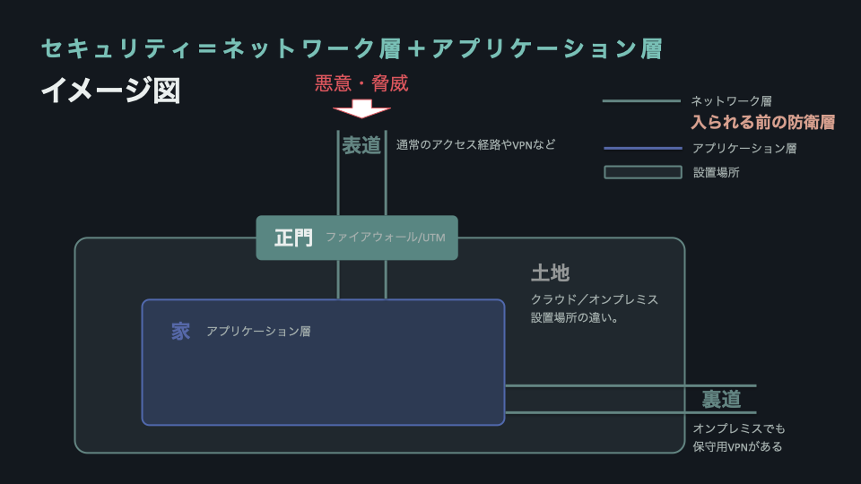

セキュリティ層は以下で守られています。

まず、「道」。インターネット通信やVPNなどのことを指します。VPNはよく聞くと思いますが「通信そのものを暗号化して守る専用通路」のことです。通常回線をより強化したものです。

次に、「門」。ファイアウォール/UTM、などを指します。ファイアウォールは「通していい通信か」を判定するネットワークの門番。出入りを監視することができます。その上位互換がUTM装置です。

脅威はこれらを通って家に向かいます。

### オンプレとクラウドについて


クラウドやオンプレミスは、家（アプリケーション層）が建っている「土地」そのものです。

オンプレミスは、通常、外のインターネットにつながっていない閉鎖式の仕組みです。外に続く道を持たず、自分の所有地の中だけに道があります。

しかし、家の中の機械が正常に動いているかを管理するために、裏道を通すことがあります。 閉鎖式の仕組みと言いながら、実は隠れた外につながる道がある、ということです。同じように、閉鎖式SIMや業務用VPNを敷けば、院内・事業所内だけでなく、モバイル端末からでもオンプレミス環境に入ってやり取りできます。

クラウドは、どこかにあるデータ置き場の中の一室を借りる仕組みです。AmazonのAWSやMicrosoftのAzureのような専用の会社が、厳重に管理してくれているビルの一室のようなものです。道（専用通路）そのものはありませんが、中身を金庫に入れ、届け先の認証をしっかりすることで、安全に通信できます。

クラウドの場合は、借りている一室がどこの国に置かれているかに加えて、その事業者にどの国の法律が及ぶかも重要な要素です。日本の法律の効力が届く範囲にあることが、ガイドラインの遵守事項になっています。

厚労省のガイドラインでは、クラウド・オンプレどちらのネットワークであっても、条件を満たした設定であれば、その経路の盗聴リスクは小さいとして適合扱いになっています。オンプレもクラウドも、条件を守って安全に使ってください、ということです。どっちの土地だから安全、という問題ではありません。


### アプリケーション層について
次にアプリケーション層です。
脅威はネットワーク層を突破したら、次に来ます。

```
【入られる前】関門の列 ＝ 順番に突破されるもの
  門 ──→ 玄関の持ち物検査 ──→ 玄関の鍵 ──→ 部屋ごとの鍵
  UTM        対策ソフト          認証          認可


【入られた後】家全体に、常時 ＝ 突破されても効いているもの
  🔦 見回り      EDR      … その場で気づく
  📓 記録簿    操作ログ    … あとから追える
```
---

## インシデント ＝ 脅威 × 脆弱性

脅威の通り道とそこで活躍するセキュリティを整理できました。次に、サイバー攻撃による事故(インシデント)について整理していきます。

> **インシデント ＝ 脅威 × 脆弱性**

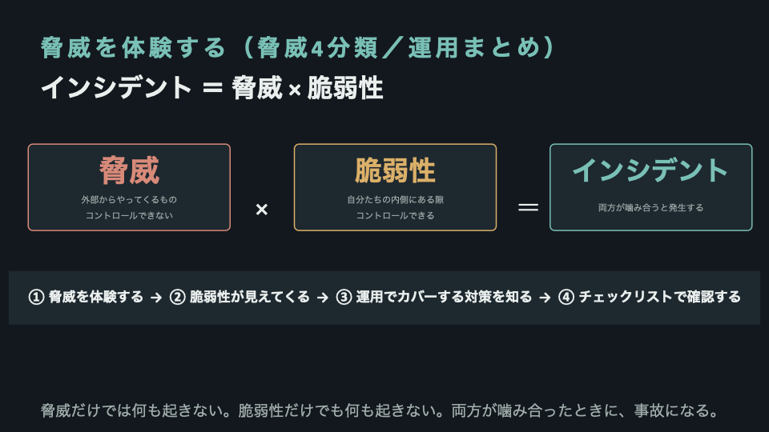

**脅威**は、悪意そのものや技術のこと。外からやってきます。自分たちではコントロールできません。
**脆弱性**は、自分たちの内側にある隙のこと。設計の隙と、運用の隙があります。運用の隙は、コントロールできます。

脅威だけでは何も起きません。脆弱性だけでも何も起きません。両方が噛み合ったときに、事故になります。
事故を防ぐために、まずは脅威を理解し、どんな脆弱性とセットなのかを確認します。その上で、経営者・管理者が行う対策とスタッフが行う対策を分けてご説明します。

医療情報セキュリティの軸で、脅威を4つに分けました。

1. 不正アクセス
2. 標的型メール攻撃（フィッシング・偽の警告）
3. マルウェア感染
4. DDoS攻撃


---

## THREAT I — 不正アクセス

正規の権限がない人がアクセスすること、すべてを不正アクセスと言います。脅威には、この不正アクセスといろんな攻撃手法の組み合わせがあります。

### 岡山県精神科医療センター（2024年5月）

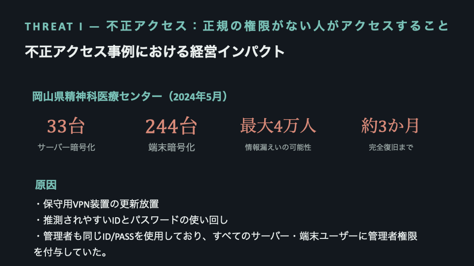

| | |
|---|---|
| サーバー暗号化 | 33台 |
| 端末暗号化 | 244台 |
| 情報漏えいの可能性 | 最大4万人 |
| 完全復旧まで | 約3か月 |

原因は、3つ重なっています。

- 保守用VPN装置の更新を放置していた
- 推測されやすいIDとパスワードを使い回していた
- しかも、そのID/パスワードに管理者権限が付いていた。全サーバー・全端末のユーザーに管理者権限を付与していた

管理者権限を取られると、何が起きるか。ウイルス対策ソフトを無効化され、バックアップを破壊されます。順番にやられます。

ここで考えたいのは、**PC端末へのログインが共通ID・パスワードになっているのは、とてもよくある**ということです。

正直に書くと、私の事業所も、モバイルもPC端末へのログインも共有アカウントです。

### 今日からできること

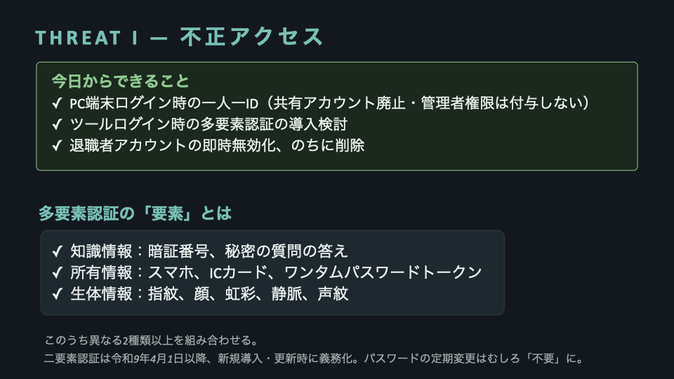

- **PC端末ログイン時の一人一ID**。共有アカウントを廃止する。難しければ、せめて共有アカウントに管理者権限を付与しない。管理者は一人一IDで使う
- **ツールログイン時の多要素認証の導入検討**
- **退職者アカウントの即時無効化、のちに削除**

多要素認証の「要素」が何を指すのか、意外と共有されていないので書いておきます。3種類あります。

| 要素 | 具体例 |
|---|---|
| 知識情報 | 暗証番号、秘密の質問の答え |
| 所有情報 | スマホ、ICカード、ワンタイムパスワードトークン |
| 生体情報 | 指紋、顔、虹彩、静脈、声紋 |

このうち**異なる2種類以上**を組み合わせるのが多要素認証です。パスワード＋秘密の質問は、どちらも知識情報なので2要素になりません。

そして重要な変更点が2つあります。

**二要素認証は、令和9年4月1日以降、システムの新規導入・更新のタイミングから義務化されます。**（医療情報システムの安全管理に関するガイドライン 第7.0版）

**パスワードの定期変更は、むしろ「不要」と明記されました。** 3か月ごとに更新しているところもあると思いますが、ガイドライン上は不要です。それより、システムごとに違うIDとパスワードを使うことのほうが大事、ということです。

義務化されるのであれば、早めに入れて慣れてもらうほうが、結果的に楽かもしれません。

---

## THREAT II — 標的型メール攻撃（フィッシング・偽の警告）

### 岡山大学病院（2021年7月）

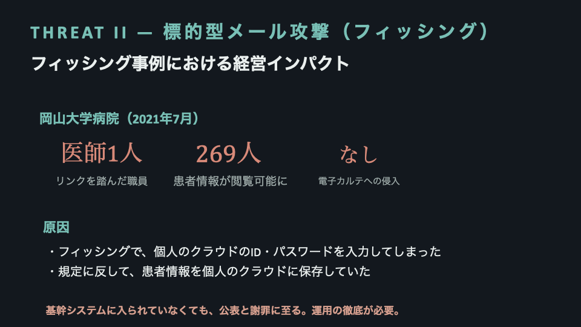

| | |
|---|---|
| リンクを踏んだ職員 | 医師1人 |
| 患者情報が閲覧可能に | 269人 |
| 電子カルテへの侵入 | なし |

医師が個人で使っていたクラウドサービスのIDとパスワードを、フィッシングメールに入力して盗まれました。そして、規定に反して、そのクラウドに患者情報のファイルが保存されていました。

**大事なのは、電子カルテには一切侵入されていないという点です。**

基幹システムは無事でした。それでも、患者さんへの説明と謝罪、そして公表に至っています。

どれだけ立派なネットワーク設計をしても、決められた場所の外にデータが一度出れば、その外側で漏れます。

もうひとつ。侵入から発覚までの日数は公表されていませんが、これは**医師が自分のクラウドに入れなくなって、初めて気づいた**事案です。攻撃者がパスワードを変えなければ、気づけていなかった可能性があります。

### フィッシングには2つの型がある

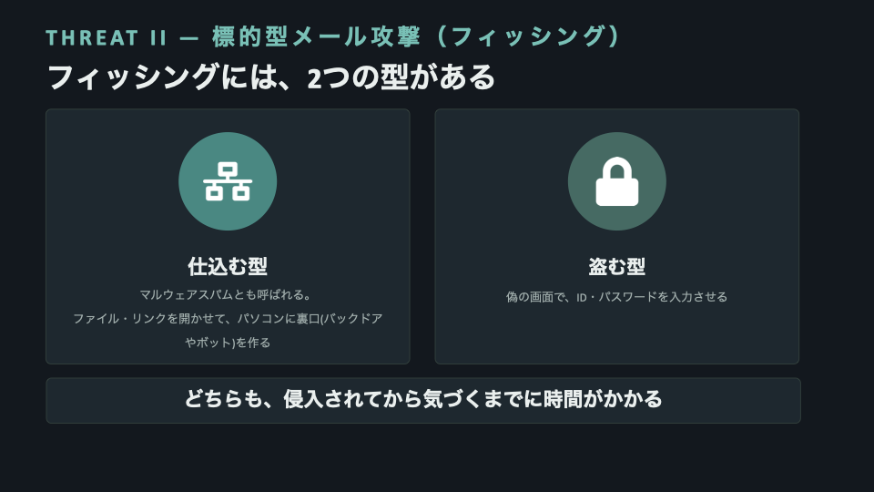

**盗む型**は、偽の画面でIDとパスワードを入力させて、鍵そのものを盗みます。

**仕込む型**は、ファイルやリンクを開かせて、パソコンに裏口（バックドアやボット）を作ります。マルウェアスパムとも呼ばれ、次のマルウェア感染との複合型です。

実は、つい先日、身近でこの仕込む型がありました。

外部とのやりとりに使っている部門の共有アドレスに、フィッシングメールが届きました。外部からのメールを受け取れるようになったばかりの、社歴の浅いスタッフが開き、リンクを踏んで、ZIPファイルをダウンロード実行してしまいました。

アプリをインストールしたわけではないので、Windows Defenderもセキュリティソフトも反応しませんでした。

たまたま熟練の総務スタッフが気づいたのでログを確認し、実害なしで済みました。でも本来、**この型は侵入されてから気づくまでに時間がかかる**のが特徴です。気づいたときには事態が大きくなっている。

### 今日からできること

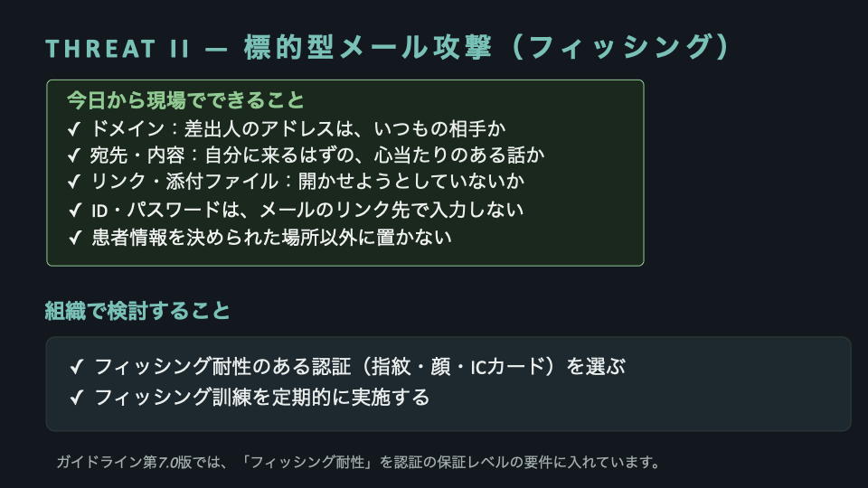

メールを見るときの4点確認です。

- **ドメイン**：差出人のアドレスは、いつもの相手か
- **宛先・内容**：自分に来るはずの、心当たりのある話か
- **リンク・添付ファイル**：開かせようとしていないか
- そして4つ目がいちばん大事です。**ID・パスワードは、メールのリンク先で入力しない。** いつも使っているアプリやブックマークから入る

組織で検討することも2つ。

**フィッシング耐性のある認証を選ぶ。** 耐性があるのは指紋・顔・ICカードです。文字列は偽装できるので、ワンタイムトークンは不向きです。耐性のある二要素認証が入っていれば、ID/パスワードを万が一盗まれても、次の認証で止められます。

人は間違えます。だから、**間違っても大丈夫な仕組み**を作る。ガイドライン第7.0版では、この「フィッシング耐性」を認証の保証レベルの要件に入れています。

**フィッシング訓練を定期的に実施する。** 厚生労働省の資料でも、全職員を対象とした定期的な教育と訓練が挙げられています。KDDIでは社員全員に意図的に偽のフィッシングメールを送り、引っかかった人を研修に呼ぶ運用をしているそうです。怖いですよね。

---

## THREAT III — マルウェア感染

悪意のあるソフトを入れられること。暗号化して使えなくするもの（ランサムウェア）もあれば、侵入した瞬間は何も起こさず、静かに居座るものもあります。

近年は、暗号化して機能不全にするだけでなく、**先に情報を盗んでおいて「払わなければ公開する」と脅す二重恐喝**が主流です。

事例を2つ、並べて見てください。

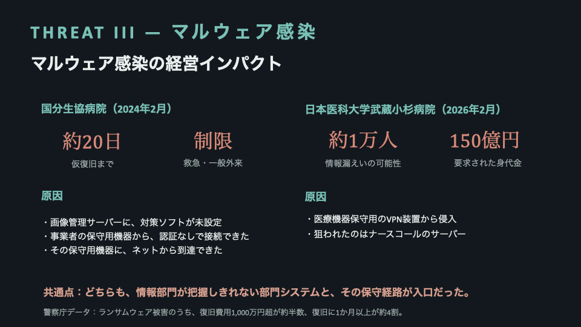

### 国分生協病院（2024年2月）

画像管理サーバーという、部門単位で使っているシステムが暗号化されました。原因は3つ重なっています。

- そのサーバーにウイルス対策ソフトが設定されていなかった
- 事業者が保守用に置いた機器から、認証なしで院内のパソコンに接続できる設定だった
- その保守用機器に、インターネットから到達できる状態だった

結果、診療記録のPDFが開けなくなり、救急と一般外来の受け入れを制限しながら紙カルテで運用。仮復旧まで約20日かかっています。

**電子カルテ自体は無事でした。それでも、これだけ止まりました。**

### 日本医科大学武蔵小杉病院（2026年2月）

深夜1時50分、病棟のナースコール端末が動かなくなりました。ナースコールを管理するサーバー3台が感染していました。

侵入経路は、**医療機器保守用のVPN装置**です。漏えいの可能性があるのは約1万人分。身代金は1億ドル、約150億円を要求されたと報じられています。病院は応じず、被害届を出しました。外来も入院も救急も、通常どおり続けられています。

### 2つの共通点

画像管理サーバーも、ナースコールも、**情報システム部門ではなく各部門が独自に導入・運用していた設備**でした。

だから情報部門の目が届かず、その保守経路が裏口になった。「院内にあるから」「いつも動いている設備だから」という理由で誰も疑わなかった機器が、そのまま侵入経路になりました。

**オンプレミスの中にいるから安全、という考え方は、もう成立しません。**

被害規模の目安も出ています。警察庁のデータでは、復旧費用が1,000万円を超えたケースが約半数、復旧に1か月以上かかった企業が約4割です。

### 今日からできること

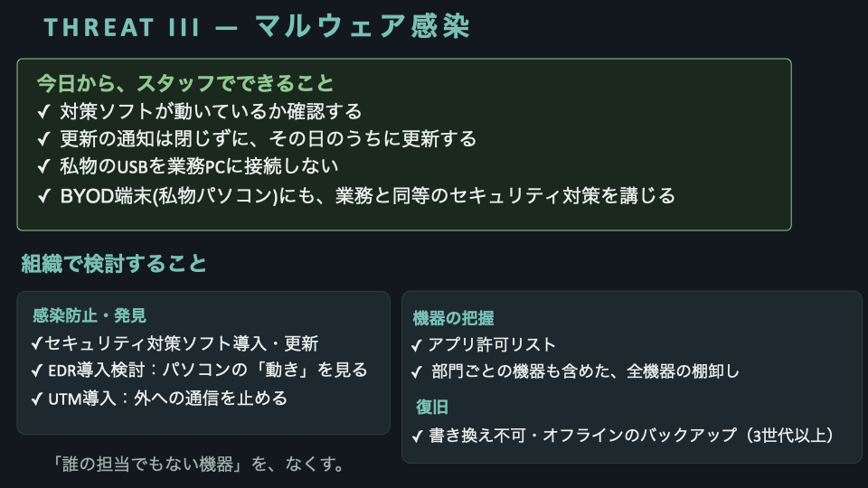

スタッフ一人ひとりが、4つ。

**対策ソフトが動いているか確認する。** 国分生協病院では、暗号化されたサーバーにそもそも対策ソフトが入っていませんでした。動いているかに気づけるのは、その機器を毎日使っている現場の人です。

**更新の通知は閉じずに、その日のうちに更新する。** 更新プログラムが配られるのは、そのソフトや機器に欠陥が見つかったときです。欠陥が見つかると「この製品のこのバージョンには、こういう弱点がある」という情報も公開されます。使う人に知らせるためです。ところが攻撃者もその情報を見ていて、まだ更新していない機器を探し回ります。**更新が出た瞬間から、更新していない機器は狙われやすくなります。**

**私物のUSBを業務PCに接続しない。**

**それでも私物のパソコンを使う場面があるなら、業務用と同等の対策を入れる。** ガイドラインにも、BYOD端末であっても医療機関が管理する機器と同等の対策を講じること、と明記されています。

組織で検討することは、3つに分けました。

#### 【感染防止・発見】

セキュリティ対策ソフトは、**知っている悪者と照合する**ソフトです。世界中で見つかったウイルスの特徴を一覧で持っていて、入ってきたファイルと突き合わせる。だから一覧を最新にしておくことが前提になります。

では、そこを通過してしまうものは何か。3つあります。

1. **パスワード付きのZIPファイル**。中を自動で開けないので、検査そのものができない
2. **まだ一覧に載っていない新しいもの**
3. **もともとパソコンに入っている道具を使われる場合**。これがいちばん厄介です。攻撃者が新しいアプリを入れずに、Windowsに最初からある機能を動かすと、対策ソフトから見れば正規のソフトが動いているだけなので反応しません

だから、通過してしまうものを捕まえる層が要ります。**EDR**と**UTM**です。

**EDR**は、侵入されることを想定したソフトです。ファイルが悪いかどうかではなく、**パソコンが変な動きをしていないか**を見ます。メールソフトが勝手に別のプログラムを起動した。深夜に見慣れない海外のサーバーと通信を始めた。そういう振る舞いを捕まえます。ガイドライン第7.0版にも、対策ソフトを導入しても全てのマルウェアが検出できるわけではないとしたうえで、EDRによる振る舞い検知も有効な方策である、と書かれています。

**UTM**は、ソフトではなく機械です。事業所のインターネット回線の出入り口に置く箱で、ファイアウォールとウイルス検査と不審な通信の遮断が1台にまとまっています。バックドアは外の攻撃者と通信して攻撃を行うので、その外部通信を**出口で止める**のがUTMです。

#### 【機器の把握】

**アプリ許可リスト**は、許可したソフトしか動かさない設定です。悪いものを弾くのではなく、許可したものだけを動かす。考え方が逆なので、まだ知られていない攻撃にも強い。ただ、新しいソフトを入れるたびに手続きが要るので、運用の手間は増えます。

そして**全機器の棚卸し**。ここがいちばん大事かもしれません。2つの事例はどちらも情報部門の管理外にあった機器でした。

> **「誰の担当でもない機器」を、なくす。**

#### 【復旧】

**書き換え不可・オフラインのバックアップを、3世代以上。**

攻撃者は暗号化を始める前に、バックアップを探して破壊します。ネットワークにつながったままのバックアップは、一緒にやられます。

---

## THREAT IV — DDoS攻撃

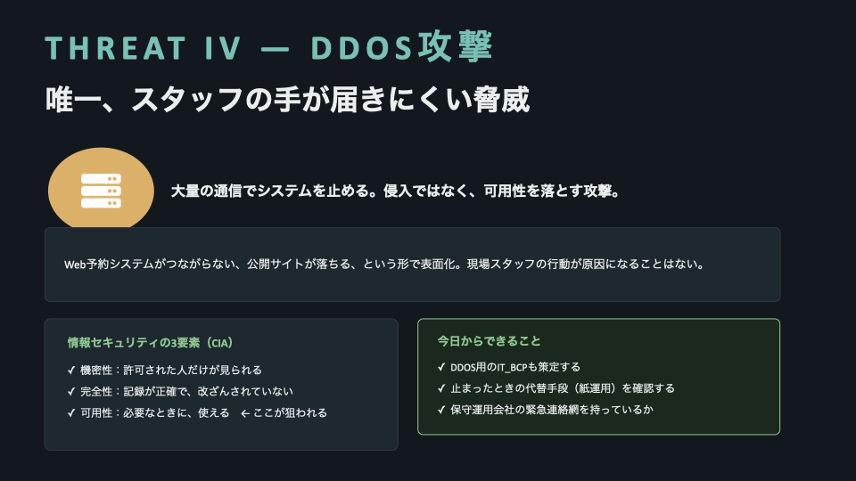

これだけは、正直に言うと**現場スタッフの行動が原因になることはありません。**

大量の通信を浴びせてサーバーを止める攻撃です。侵入ではなく、可用性を落とす。Web予約システムがつながらない、公開サイトが落ちる、という形で表面化します。

「基幹システムは動いているんだから、そこまで重要じゃないのでは」と感じる方もいるかもしれません。

ここで、情報セキュリティの3要素（CIA）に戻ります。

| 要素 | 意味 |
|---|---|
| 機密性 | 許可された人だけが見られる |
| 完全性 | 記録が正確で、改ざんされていない |
| **可用性** | **必要なときに、使える** ← ここが狙われる |

DDoS攻撃が狙うのは3つ目です。情報は盗まれません。書き換えられもしません。ただ、**使えなくなる。**

守るべきものは、情報だけではない、ということです。

### 今日からできること

- **止まったときの代替手段（紙運用）を確認する**
- **保守運用会社の緊急連絡網を持っているか確認する**
- **DDoS用のIT_BCPも策定する**

---

## ここまでの運用まとめ

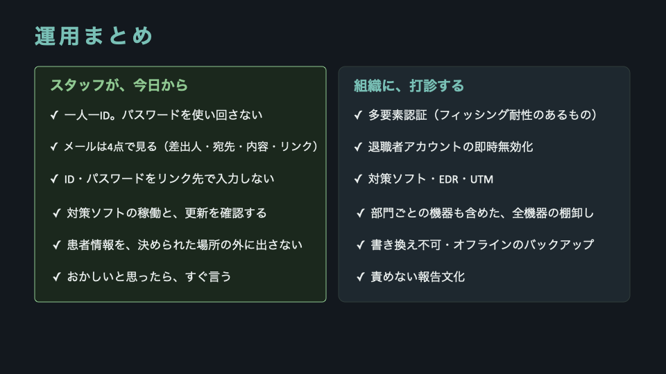

**スタッフが、今日から**

- 一人一ID。パスワードを使い回さない
- メールは4点で見る（差出人・宛先・内容・リンク）
- ID・パスワードをリンク先で入力しない
- 対策ソフトの稼働と、更新を確認する
- 患者情報を、決められた場所の外に出さない
- おかしいと思ったら、すぐ言う

**組織に、打診する**

- 多要素認証（フィッシング耐性のあるもの）
- 退職者アカウントの即時無効化
- 対策ソフト・EDR・UTM
- 部門ごとの機器も含めた、全機器の棚卸し
- 書き換え不可・オフラインのバックアップ
- **責めない報告文化**

最後の1行が、実は全部を支えます。おかしいと思ったら報告。やってしまったかもと思ったら報告。それに気づける知識が要るし、その報告を責めない文化が要ります。

---

## ところが、その「基本」の前提が崩れかけています

ここまで読んで、「なんだ、結局は基本的なことばかりか」と、少し安心された方もいるかもしれません。

パスワードを使い回さない。リンクを不用意に踏まない。違和感を報告する。難しい話ではありません。

ところが。

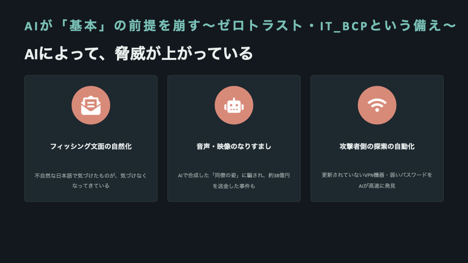

**フィッシング文面の自然化。** 不自然な日本語で気づけたものが、気づけなくなってきています。

**音声・映像のなりすまし。** 2024年2月、香港のある企業で、経理担当者がAIで合成した「同僚の姿」によるビデオ通話にだまされ、約38億円を送金しました。医療現場でいえば、「ベンダーの担当者」や「上長」を装った電話やビデオ通話で、パスワードの変更や緊急のアクセス許可を求められる。もう絵空事ではありません。

**攻撃者側の探索の自動化。** 以前は人手で探していた「更新されていないVPN機器」「弱いパスワードのアカウント」を、AIが自動で、しかも高速に見つけ出せるようになってきています。

（香港の事件は一般企業を狙った国際事例で、医療機関を狙った同種の事例ではありません）

---

## だから、入られる前提の守りと、起きたときの手順

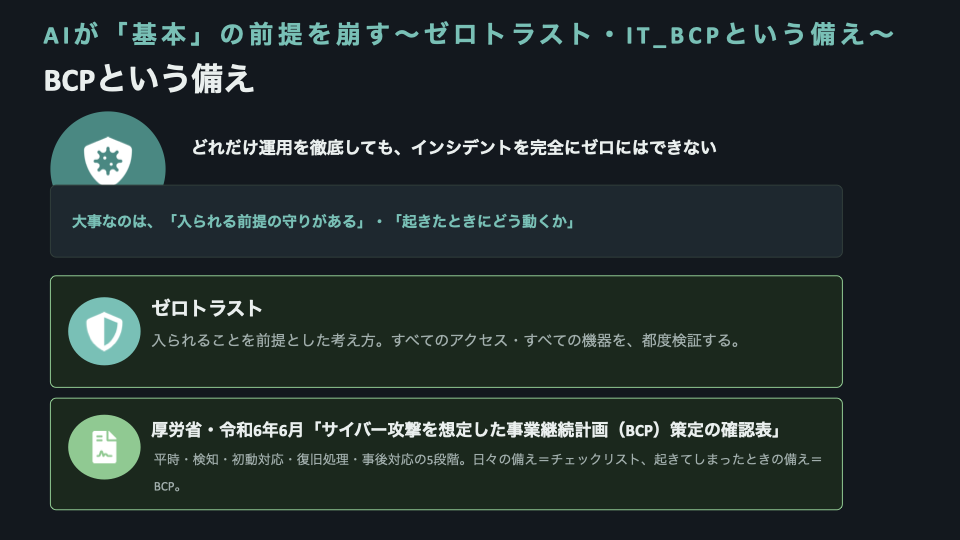

正直に書きます。どれだけ運用を徹底しても、「絶対に何も起きない」とは言い切れません。

だからこそ、2つ。

**ゼロトラスト。** 境界の内側なら安全、という前提をやめて、すべてのアクセス・すべての機器を、その都度検証する考え方です。ただしガイドラインでは、実装には費用や管理の負担が大きく、小規模な医療機関で導入することは必ずしも容易ではない、とも述べられています。

**IT_BCP。** 起きたときにどう動くかを事前に決めておく、事業継続計画です。厚生労働省が令和6年6月に「サイバー攻撃を想定した事業継続計画（BCP）策定の確認表」を出しています。平時・検知・初動対応・復旧処理・事後対応の5段階で、何を決めておくべきかが一覧になっています。

チェックリストが「日々の備え」だとすれば、BCPは「起きてしまったときの備え」です。

- 厚労省・令和8年度版 サイバーセキュリティ対策チェックリスト
- 厚労省・令和6年6月 BCP策定の確認表
- 医療情報システムの安全管理に関するガイドライン 第7.0版（令和8年6月）

---

## 質疑でいただいた質問：層ごとに、具体的に何を施すのか

セッションの最後に、こう聞かれました。

> ネットワーク層とアプリケーション層で、具体的にどんなセキュリティを施す必要があるのか。

5月の記事で「セキュリティは場所ではなく設計と運用」と書き、層の分け方までは説明していました。その先を問われた形です。時間内に話しきれなかったので、ここに書きます。

先にお伝えしたいのは、**これは「自分たちで実装するリスト」ではない**ということです。

実装するのは保守運用会社やベンダーです。私たちがやるのは、**それがちゃんと施されているかを確認すること**。確認のための地図が要る。それが以下です。

### 勘所は3つ

#### ① 契約している会社のMDS/SDSで、要件を守った設計になっているか

ガイドライン第7.0版で、MDS/SDS——製造業者・サービス事業者による医療情報セキュリティ開示書——の提出が必須になりました。保守委託先から医療機関に出される書類です。

口頭で「うちのセキュリティ、どうなってますか」と聞いても、たぶん「大丈夫です」と返ってきます。そうではなく、**開示書に書いてあることと、ガイドラインの要件を突き合わせる。**

見るべき項目を挙げます。

- 取り扱うデータの項目（患者氏名・病名・検査データ……どこまで持つか）
- 保存場所。どの国のどのリージョンか
- その事業者に、どの国の法律が及ぶか（**日本の法令の効力が及ぶ範囲であることが遵守事項**）
- 通信の暗号化と、保存時の暗号化。鍵は誰が持つか
- 認証方式。二要素に対応しているか。していないなら、いつ対応するか
- 権限管理。役割ごとに分けられるか。管理者権限を誰が持つか
- 操作ログ。何を、どれだけの期間、残すか。医療機関側から見られるか
- バックアップ。世代数、保管場所、書き換え不可か
- 脆弱性対応。更新の提供方法と、製品のサポート期限
- インシデント時の連絡先と、責任分界
- 再委託先があるか。あるなら、そこの要件はどうか

#### ② サーバーやUIに繋がるとき、どこにデータがあるか

いちばん見落とされるのが、ここです。

「クラウドだから安全」「オンプレだから安全」ではなく、**そのデータが今どこに置かれているかを、経路ごとに言えるか。**

書き出してみると、思っているより多いです。

- 入力している画面（UI）が動いている端末
- そこから出ていく通信の経路
- 保存されているサーバー（クラウドなら、どの国のどのリージョンか）
- バックアップの保管先
- 操作ログの保管先
- 保守運用会社が使っている保守端末・保守経路
- そして——**ダウンロードフォルダ、キャッシュ、スクリーンショット、メールの添付、個人のクラウド**

岡山大学病院の事案は、まさに最後の行です。電子カルテには一切侵入されていないのに、公表と謝罪に至りました。

#### ③ そこへのアクセスを、どう絞っているか

データの居場所がわかったら、次は入口です。

- **認証ログインが二要素になっていること**（令和9年4月1日以降、新規導入・更新のタイミングから義務化）
- **簡単すぎるパスワードになっていないこと**（定期変更はもう不要。使い回さないことのほうが大事）
- **一人1IDであること**（共有アカウントをやめる。難しければ、せめて管理者権限は付与しない）

この3つだけで、岡山県精神科医療センターの事案の原因の大半が潰れます。

いよいよ、冒頭の「家」の図（正門・表道・裏道）を実際のチェック項目に落とし込みます。


### ネットワーク層で、具体的に施すもの

「正門・表道・裏道」＝入られる前の防衛層です。

| 施すもの | 何のためか | 医療機関側の確認ポイント |
|---|---|---|
| ファイアウォール／UTM | 通していい通信かを判定し、外への不審な通信も止める | 設置されているか。ログは取れているか。誰が設定を管理しているか |
| VPN機器の脆弱性管理 | 更新放置が最大の侵入口 | 機種とバージョン、サポート期限。更新は誰がいつ行うか |
| 保守用のリモート経路 | 常時つながっている裏道をなくす | 常時接続か、必要時のみ開通か。認証はあるか。誰が使ったかログに残るか |
| 管理画面をインターネットに晒さない | 探索は自動化されている | 外から到達できる機器・管理画面がないか |
| ネットワークの分離 | 部門システム・医療機器を業務LANと分ける | 画像管理サーバー、ナースコール、複合機、Wi-Fi（業務／ゲスト）が分かれているか |
| 通信の暗号化 | 経路上の盗聴を防ぐ | クラウドなら専用線でなくとも、条件を満たせば適合扱い |
| DDoS対策（CDN等） | 可用性を守る | 契約・SLAに含まれているか。止まったときの紙運用と緊急連絡網 |
| 全機器の棚卸し | 「誰の担当でもない機器」をなくす | 部門が独自に入れた機器まで台帳に載っているか |

最後の行が、いちばん効きます。国分生協病院も、日本医科大学武蔵小杉病院も、情報システム部門の管理外にあった機器と、その保守経路が入口でした。

### アプリケーション層で、具体的に施すもの

「入られる前と、入られた後の防衛層」です。軸は**認証・認可・操作ログ**の3つ。

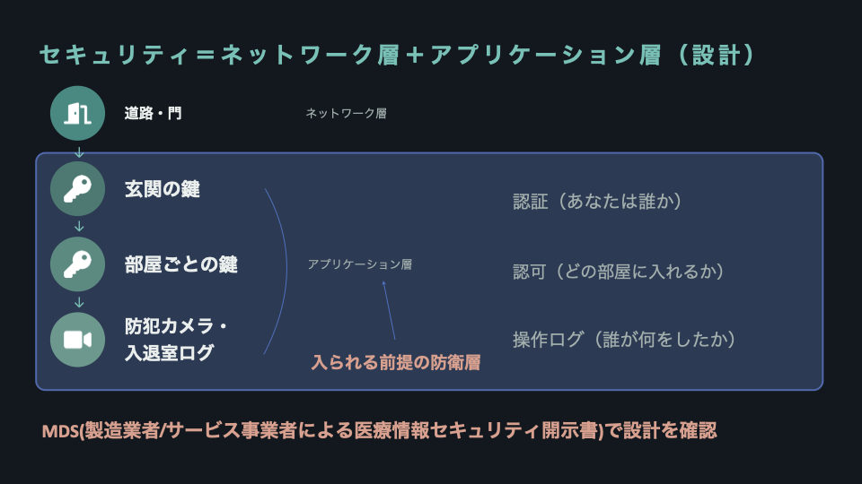

| 施すもの | 何のためか | 医療機関側の確認ポイント |
|---|---|---|
| 認証（あなたは誰か） | 玄関の鍵 | 二要素になっているか。フィッシング耐性のある要素（指紋・顔・ICカード）か |
| パスワードの強度 | 推測・使い回しを潰す | 短すぎないか。システムごとに別か。定期変更は不要 |
| 一人1ID | 誰がやったかを特定できる状態にする | 共有アカウントがどこに残っているか。管理者権限は分離されているか |
| 認可（どの部屋に入れるか） | 役割・閲覧権限・編集権限 | 最小権限になっているか。全員が管理者権限、になっていないか |
| 操作ログ（誰が何をしたか） | 検知と、事後の追跡 | 取得されているか。改ざんされない場所にあるか。誰かが定期的に見ているか |
| アカウントのライフサイクル | 放置アカウントを消す | 入職・異動・退職で即時に反映されるか。退職者は無効化のうえ削除 |
| 保存データの暗号化と所在 | 漏れても読めない状態に | 保存先のリージョンと準拠法。鍵の管理者 |
| 端末側の防御（EDR・対策ソフト） | 入られた後の振る舞いを捕まえる | 稼働しているか。更新されているか。BYODにも同等の対策があるか |
| アプリ・OSの更新 | 公開された弱点を塞ぐ | 更新通知を放置していないか。サポート切れの製品が残っていないか |
| バックアップ | 復旧の最後の砦 | 書き換え不可・オフライン・3世代以上 |

---

## 明日ベンダーに投げる、3つの問い

長く書きましたが、圧縮するとこうなります。

1. **MDS/SDSを見せてください。** ガイドラインの要件と、どこがどう対応していますか
2. **患者情報は、いま具体的にどこにありますか。** 保存先・バックアップ先・ログ・保守端末まで含めて
3. **そこに入る鍵は、二要素ですか。一人1IDですか。使い回されていませんか**

わからないから怖い。怖いから何も導入しない。

その状態から抜けるために必要なのは、専門家になることではなくて、**この3つを聞ける言葉を持つこと**だと思っています。

聞かれた側も、聞かれれば答えます。聞かれないから、そのままになっているだけ、ということが、けっこうあるので。

---

攻撃の入口の大半は、ゼロデイでも天才ハッカーでもありません。

**使い回し・放置・私物・無視**という、日常の小さな習慣です。

だから施設管理者の最大の武器は、高価な機材ではなく、**「行動のルール化」と「責められない報告文化」**なのだと思います。
